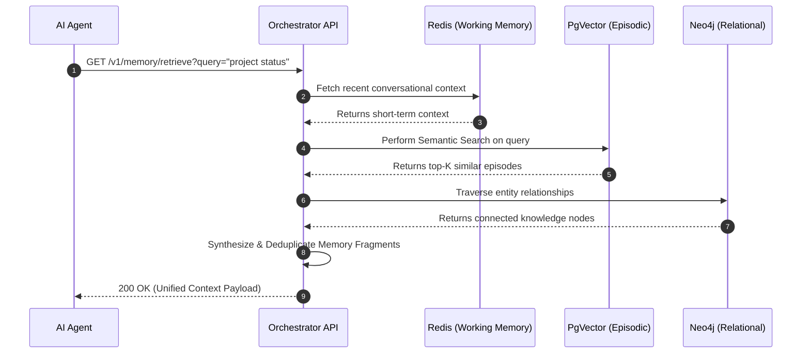

<div align="center">
  
</div>

<h1 align="center">Memory Orchestrator</h1>

<p align="center">
  <strong>The Cognitive Storage and Retrieval Engine for LLMs and AI Agents</strong>
</p>

<p align="center">
  <a href="https://github.com/Devopstrio/memory-orchestrator/actions/workflows/ci.yml"></a>
  <a href="https://github.com/Devopstrio/memory-orchestrator/actions/workflows/lint.yml"></a>
  <a href="https://github.com/Devopstrio/memory-orchestrator/actions/workflows/security-scan.yml"></a>
  <a href="https://python.org"></a>
  <a href="https://fastapi.tiangolo.com/"></a>
  <a href="https://neo4j.com/"></a>
  <a href="https://github.com/pgvector/pgvector"></a>
</p>

---

## 📌 Executive Summary

**Memory Orchestrator** is the centralized intelligence component designed for the Devopstrio Enterprise Context Engineering platform. It acts as the cognitive brain for LLM-powered applications, dynamically orchestrating short-term context, long-term episodic memory, and complex semantic relationships.

By abstracting away the underlying storage complexities, it provides a unified RESTful API to store, retrieve, and automatically summarize memories using a combination of **Redis** (Working Memory), **PgVector** (Semantic Search), and **Neo4j** (Knowledge Graphs).

## 🏗️ System Architecture

Our cognitive architecture is built to mimic human memory systems, ensuring LLMs have the right context at the right time without bloat.

<div align="center">
  
  <br/>
  <em>Figure 1: High-Level Cognitive Architecture and Data Flow</em>
</div>

### Data Topology & Infrastructure

<div align="center">
  
  <br/>
  <em>Figure 2: 3D Topology of the Cognitive Storage Cluster (PgVector, Neo4j, Redis)</em>
</div>

### Memory Retrieval Sequence

The following sequence illustrates how the orchestrator synthesizes a response from multiple memory tiers:



## ✨ Core Features

| Feature | Description | Technology Stack |
|---------|-------------|------------------|
| **Multi-Tier Memory** | Seamlessly routes data between short-term cache, vector embeddings, and graph databases. | Redis, PgVector, Neo4j |
| **Automated Compaction** | Background jobs automatically summarize older conversational context to prevent token bloat. | Python AsyncIO |
| **Semantic Routing** | Intelligent intent detection to determine which memory store yields the highest relevance. | Sentence-Transformers |
| **Knowledge Graphs** | Maps entities and relationships dynamically as new memories are ingested. | Neo4j Cypher |
| **Enterprise Scale** | Designed for Kubernetes with high-availability storage adapters. | FastAPI, AsyncPG |

## 🚀 Quick Start (Local Development)

Boot up the entire cognitive cluster locally using Docker Compose.

### 1. Prerequisites
- Python 3.12+
- Docker & Docker Compose
- `make` utility

### 2. Initialization
```bash
# Clone the repository
git clone https://github.com/Devopstrio/memory-orchestrator.git
cd memory-orchestrator

# Configure virtual environment and dependencies
make install-dev

# Initialize environment variables
cp .env.example .env
```

### 3. Launch the Stack
```bash
# Boot the FastAPI server, Neo4j, Postgres (with pgvector), and Redis
make docker-up
```
The Memory API is now available at `http://localhost:8080`.

## 📚 Comprehensive Documentation

Explore our exhaustive library of technical guides, ADRs, and runbooks located in the [`/docs`](./docs/README.md) directory.

### 📐 Architecture & Design
- [High-Level Design (HLD)](./docs/architecture/HLD.md)
- [Low-Level Design (LLD)](./docs/architecture/LLD.md)
- [Architecture Decision Records (ADRs)](./docs/architecture/decisions/)
- [Mermaid System Diagrams](./docs/diagrams/)

### 📖 Developer & API Guides
- [API Reference Guide](./docs/api/API_REFERENCE.md)
- [OpenAPI Specification](./docs/api/openapi.yaml)
- [Local Installation Guide](./docs/guides/INSTALLATION.md)

### 🛡️ Security & Operations
- [Threat Model & Compliance](./docs/security/THREAT_MODEL.md)
- [SRE Runbook](./docs/operations/RUNBOOK.md)
- [Kubernetes Deployment Guide](./docs/guides/DEPLOYMENT.md)

## 🤝 Contributing

We welcome contributions from the internal Devopstrio team! Please review our [Contributing Guidelines](CONTRIBUTING.md) and [Code of Conduct](CODE_OF_CONDUCT.md) before submitting pull requests.

## 📄 License

This project is licensed under the [MIT License](LICENSE) - Copyright (c) 2026 Devopstrio.

---
<div align="center">
  <p><b>Built with precision by Devopstrio Enterprise Engineering.</b></p>
</div>
